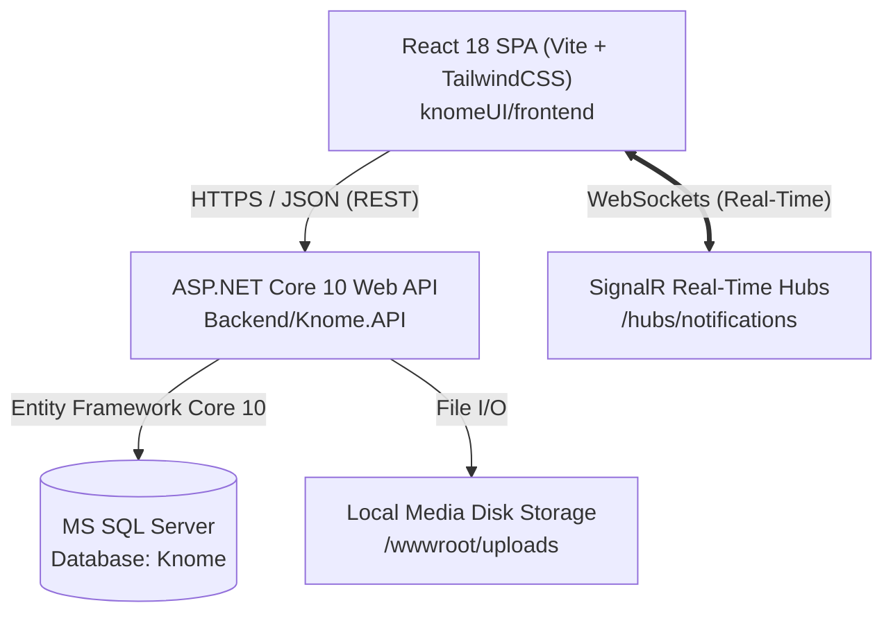
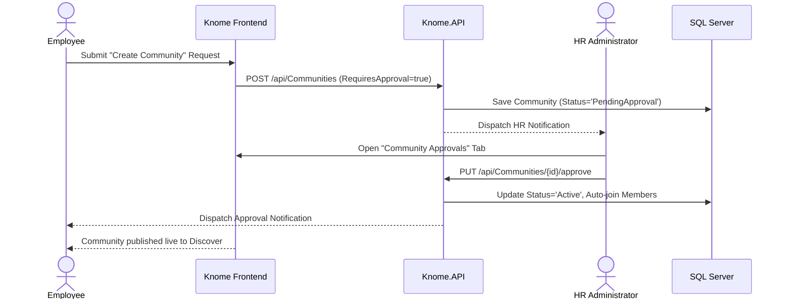

# Knome — Design System & Platform Architecture Specification (`DESIGN.md`)

> **Enterprise Knowledge Management & Social Collaboration Platform**  
> **Client Organization:** MPOnline Limited  
> **Stack:** ASP.NET Core 10 (.NET 10) + React 18 / Vite / TailwindCSS + MS SQL Server  

---

## 1. Executive Summary & Brand Identity

**Knome** is an enterprise knowledge-sharing, professional networking, and continuous learning platform engineered exclusively for **MPOnline Limited**. It synthesizes the most effective interaction patterns of leading digital platforms into a unified internal intranet:

```
┌─────────────────────────────────────────────────────────────────────────────┐
│                             KNOME HYBRID MODEL                              │
├───────────────────────┬────────────────────────────┬────────────────────────┤
│   LINKEDIN FOUNDATION │      MEDIUM PUBLICATION    │    YOUTUBE LEARNING    │
├───────────────────────┼────────────────────────────┼────────────────────────┤
│ • Enterprise Feed     │ • Long-form Articles       │ • Video Lectures       │
│ • 1st-Degree Network  │ • WYSIWYG Rich Editor      │ • YouTube Playlists    │
│ • Professional Roster │ • Reading Time Calculator  │ • Audio Podcasts       │
│ • Internal Job Board  │ • Curated Categories       │ • Global Audio Drawer  │
│ • Gamified Karma      │ • Scheduled Releases       │ • Channel Subscriptions│
└───────────────────────┴────────────────────────────┴────────────────────────┘
```

---

## 2. Design System & Aesthetics (Visual Foundation)

Knome utilizes an **Energetic Neon & Cyber Aurora** visual language. It adheres to the **60-30-10 Color Balance Rule**, creating a modern enterprise interface with glassmorphic cards, luminous ambient gradients, and responsive micro-interactions.

### 2.1 The 60-30-10 Color Palette

```
   60% Dominant (Surfaces)       30% Structural (Borders & Muted)    10% Accent (CTA & Highlights)
┌───────────────────────────┐   ┌───────────────────────────────┐   ┌────────────────────────────┐
│ Light: #F8FAFC (Slate 50) │   │ Light: #E2E8F0 (Slate 200)    │   │ Primary: #4F46E5 (Indigo)  │
│ Dark:  #090D16 (Deep Void)│   │ Dark:  #1E293B (Slate 800)    │   │ Aurora:  #EC4899 (Pink)    │
│ Surface Light: #FFFFFF    │   │ Text Muted Light: #64748B     │   │ Cyan:    #06B6D4 (Cyan)    │
│ Surface Dark:  #0F172A    │   │ Text Muted Dark:  #94A3B8     │   │ Emerald: #10B981 (Success) │
└───────────────────────────┘   └───────────────────────────────┘   └────────────────────────────┘
```

#### CSS Token Mapping (`knomeUI/frontend/src/index.css`)
```css
:root {
  /* 60% Dominant (Canvas & Surfaces) */
  --theme-60: #f8fafc;
  --theme-60-surface: #ffffff;

  /* 30% Structural (Borders & Supporting Text) */
  --theme-30: #e2e8f0;
  --theme-30-text: #64748b;
  --theme-30-hover: #f1f5f9;

  /* 10% Accent (Call to Actions & Micro-glows) */
  --theme-10: #4f46e5;       /* Electric Indigo */
  --theme-10-glow: #ec4899;  /* Luminous Pink */
  
  --text-primary: #0f172a;
  --text-secondary: #475569;
  --text-muted: #94a3b8;

  --shadow-premium: 0 10px 30px rgba(79, 70, 229, 0.05), 0 1px 3px rgba(0, 0, 0, 0.02);
}

.dark {
  --theme-60: #090d16;
  --theme-60-surface: #0f172a;
  --theme-30: #1e293b;
  --theme-30-text: #94a3b8;
  --theme-30-hover: #1e293b80;

  --theme-10: #6366f1;
  --theme-10-glow: #f43f5e;

  --text-primary: #f8fafc;
  --text-secondary: #cbd5e1;
  --text-muted: #64748b;

  --shadow-premium: 0 10px 30px rgba(0, 0, 0, 0.35);
}
```

### 2.2 Typography & Iconography
- **Primary Typeface:** `Plus Jakarta Sans`, falling back to `Inter` and system sans-serif.
- **Iconography:** Google `Material Symbols Outlined` with variable fill support (`font-variation-settings: 'FILL' 1`).
- **Hierarchy:**
  - **Display / Hero Titles:** `text-4xl` to `text-6xl`, font-black, gradient clip text (`from-blue-600 via-indigo-600 to-cyan-500`).
  - **Section Headings:** `text-xl` to `text-2xl`, font-black, tight tracking (`tracking-tight`).
  - **Body / Content:** `text-sm` to `text-base`, font-normal, leading-relaxed (`line-height: 1.6`).
  - **Captions & Meta Badges:** `text-[11px]` to `text-xs`, font-bold, uppercase tracking-wider.

### 2.3 Micro-Animations & Component Elevation
- **Card Lift:** `.card-lift:hover { transform: translateY(-3px); box-shadow: var(--shadow-premium); transition: all 0.3s cubic-bezier(0.16, 1, 0.3, 1); }`
- **Glassmorphism:** `backdrop-filter: blur(16px); background: rgba(255, 255, 255, 0.75);` (Light) and `background: rgba(15, 23, 42, 0.75);` (Dark).
- **Text Scramble / Shimmer:** Dynamic text scramble headers in Dashboard greeting.
- **Scroll Expansion Hero:** Interactive hero banner expansion on scroll.

---

## 3. High-Level Software Architecture

Knome is organized as a production-grade monorepo containing a modern decoupled architecture:



### 3.1 Backend 4-Tier Pattern
1. **Controllers (`Controllers/`):** Thin HTTP adaptors handling route bindings, authorization attributes (`[Authorize(Roles = ...)]`), and returning standardized envelopes `ApiResponse<T>`.
2. **Services (`Services/`):** Complete domain business logic, validation enforcement, karma transaction orchestration, notification dispatches, and event triggers.
3. **Repositories (`Repositories/`):** Data access layer encapsulating EF Core queries with eager loading (`.Include()`), projection (`.Select()`), and atomic multi-table cascades.
4. **Data Models (`Models/` & `Data/KnomeDbContext.cs`):** Scaffolded representations of SQL Server tables. **Strict rule:** Schema changes originate from SQL migrations only.

### 3.2 Role-Based Access Control (RBAC) Matrix
Knome implements 4 distinct enterprise roles encoded into HS256 JWT tokens:

| Feature / Action | `Employee` (`EMP`) | `Community Admin` (`CADM`) | `HR Administrator` (`HRADM`) | `System Administrator` (`SYSADM`) |
| :--- | :---: | :---: | :---: | :---: |
| **View Feeds, Articles, Videos, Podcasts** | ✅ | ✅ | ✅ | ✅ |
| **Write Posts & Articles** | ✅ | ✅ | ✅ | ✅ |
| **Upload Videos & Podcasts** | ✅ | ✅ | ✅ | ✅ |
| **Propose Community Creation** | ✅ (Needs HR Approval) | ✅ (Needs HR Approval) | ✅ (Direct Launch) | ✅ (Direct Launch) |
| **Approve / Reject Proposed Communities** | ❌ | ❌ | ✅ | ✅ |
| **Pin / Manage Specific Community Posts** | ❌ | ✅ (Assigned comms) | ✅ | ✅ |
| **Post Internal Job Openings** | ❌ | ❌ | ✅ | ✅ |
| **Broadcast HR Announcements** | ❌ | ❌ | ✅ | ✅ |
| **Create Article Categories** | ❌ | ❌ | ❌ | ✅ |
| **Moderate Content & Resolve Reports** | ❌ | ❌ | ❌ | ✅ |
| **Suspend Users & View Audit Logs** | ❌ | ❌ | ❌ | ✅ |

---

## 4. Core Subsystem & Workflow Design

### 4.1 Global Feed & Multi-Attachment Engine
- **Audiences:** Post author can target `Everyone` (Global feed broadcast), `Specific Community` (Restricted to community members), or `Specific Connections` (Private direct sharing).
- **Attachments:** Unified support for images, videos, audio clips, and documents (`.pdf`, `.docx`, `.xlsx`).
- **Scheduled Publishing:** Author can set future publication dates (`DD/MM/YYYY, hh:mm A`). Scheduled items stay private to the author until the scheduled timestamp, when `JobExpiryHostedService` or author's instant "Publish Now" action releases them.
- **Reactions & Karma:** Real-time optimistic likes, comments drawer with nested replies, and automated karma awarding (+2 pts for creating post, +1 pt for receiving like).

### 4.2 Knowledge Hub & WYSIWYG Publications (Articles)
- **Editor Mode:** Rich text editing engine utilizing `contentEditable` with instant formatting (`Bold`, `Italic`, `Underline`, `Bullet List`, `Numbered List`) and keyboard shortcuts (`Ctrl+B`, `Ctrl+I`, `Ctrl+U`).
- **Reading Time Metric:** Dynamically calculated based on word count (`200 words/minute`).
- **Dynamic Category Taxonomies:** System Admins can add custom categories (`POST /api/articles/categories`) which propagate dynamically across filter pills and create dialogs.

### 4.3 Media Channels (Video & Podcast)
- **Video Catalog:** Embedded video player with fallback to demo streams, duration badges, real-time view tracking, and support for importing external YouTube playlists.
- **Audio Podcasts & Global Audio Drawer:** Powered by `AudioContext`. Allows continuous audio playback while the user navigates across different pages of the application, complete with scrub bars, speed control, and volume sliders.

### 4.4 Community Governance & Member Lifecycle


### 4.5 Global Search & Discovery
- Unified search index across 6 core entities: `Posts`, `Articles`, `Videos`, `Podcasts`, `Communities`, and `Users (People)`.
- Full-text hashtag support: Normalizes `#tag` to match exact content tokens and taxonomy tags.
- Search history persistence with individual item deletion and one-click history purge.

### 4.6 Progressive Scroll-Wise Loading Architecture
To maintain instantaneous initial page paint and zero DOM thrashing, all catalog views utilize the unified `useScrollLoading` hook:

```
[Page Loads] ──────> Initial Batch Rendered (6–8 items)
                           │
                     [User Scrolls]
                           │
      Is Window Scroll near bottom? (offset <= 400px)
                           ├── No  ──> Keep current render
                           └── Yes ──> [ScrollLoadingIndicator (Animated Spinner)]
                                             │
                                     Increment visibleCount (+6 or +8)
                                             │
                                     Render next batch cleanly
```

---

## 5. Directory & File Structure Reference

```
d:/Knome main/
├── Backend/Knome.API/                # ASP.NET Core 10 Web API
│   ├── Controllers/                  # 14 RESTful Controllers (ApiResponse<T>)
│   ├── Services/                     # Domain Business Logic & Rule Enforcement
│   ├── Repositories/                 # Data Access Layer & EF Core Queries
│   ├── Models/                       # Scaffolded Database Entities
│   ├── DTOs/                         # Data Transfer Objects & Payloads
│   ├── Background/                   # Background Hosted Services
│   ├── Converters/                   # UTC DateTime JSON Converters
│   └── Extensions/                   # DI Registrations & Middleware Pipeline
├── knomeUI/frontend/                 # React 18 / Vite / TailwindCSS SPA
│   ├── src/
│   │   ├── components/
│   │   │   ├── layout/               # Navbar, Sidebar, Page Shell
│   │   │   ├── modals/               # CreatePost, CreateArticle, Modals
│   │   │   ├── widgets/              # PostCard, HotPosts, TrendingTags
│   │   │   ├── contexts/             # UserContext, AudioContext, ToastContext
│   │   │   └── ui/                   # ScrollLoadingIndicator, Hero Components
│   │   ├── hooks/
│   │   │   └── useScrollLoading.js   # Progressive Scroll Hook
│   │   ├── pages/                    # 17 Application Views
│   │   └── utils/                    # apiService, apiClient, articleService
│   └── package.json
├── Documentation/                    # Architecture Specs & 59 Dev Journals
├── DESIGN.md                         # This Document
└── AGENTS.md                         # Agent Operating Rules & Source of Truth
```

---

## 6. Verification & Quality Standards

- **Zero Unit-Test Mocking:** All backend verifications run live against MS SQL Server (`localhost`, Database `Knome`) via scratch console test runners.
- **Frontend Quality:** Production builds (`npm run build`) must compile cleanly with 0 TypeScript/JSX errors in under 2 seconds.
- **Backend Quality:** `dotnet build -nologo` must compile with 0 Errors.
- **Change Log Protocol:** Every implementation phase is persisted into `Documentation/Development Journal/` before release.
