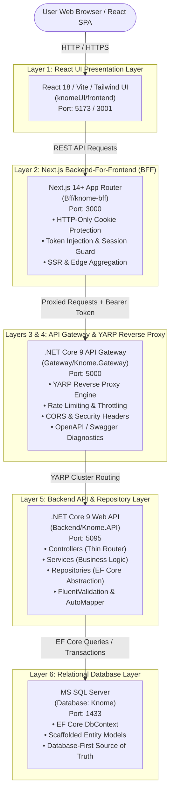
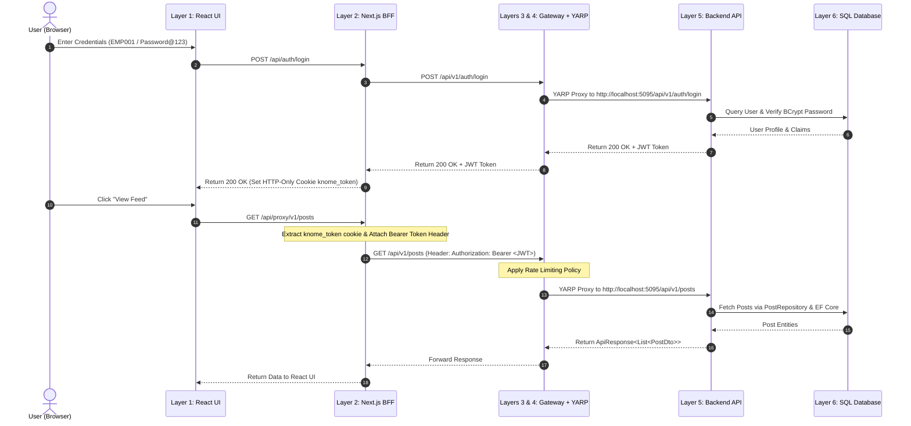

# Knome Platform: 6-Tier Architecture Specification Document

## Executive Summary

This document provides the complete technical specification for the **6-Tier Architecture** of the **Knome Enterprise Knowledge Management Platform** developed for **MPOnline Limited**. 

The platform decouples client presentation, backend-for-frontend orchestration, enterprise gateway security, reverse proxy routing, core business logic/repositories, and relational data persistence into 6 distinct, loosely coupled layers.

---

## High-Level System Architecture Diagram



---

## Detailed Layer Specifications

### Layer 1: React UI Presentation Layer

* **Location**: `knomeUI/frontend`
* **Technologies**: React 18, Vite, Tailwind CSS, JavaScript (ES6+)
* **Port**: `http://localhost:5173` (Vite Dev) / `http://localhost:3001`
* **Primary Responsibilities**:
  1. Render client UI components, interactive navigation, media player feeds, post creation modal dialogs, and community management interfaces.
  2. Maintain local component UI state, form input validations, and client side routing.
  3. Never store raw JWT access tokens in vulnerable `localStorage` or `sessionStorage`.
  4. Communicate exclusively with Layer 2 (Next.js BFF) via `/api/proxy/*` endpoints.

#### Key Configuration File: `src/utils/apiClient.js`
```javascript
// Layer 1 (React UI) -> Layer 2 (Next.js BFF)
const BASE_URL = window.ENV_BFF_URL || 'http://localhost:3000/api/proxy';

export const apiClient = {
    async request(endpoint, options = {}) {
        const url = `${BASE_URL}${endpoint}`;
        const config = { ...options, headers: { 'Content-Type': 'application/json', ...options.headers } };
        const response = await fetch(url, config);
        // ... response handling
    }
};
```

---

### Layer 2: Next.js Backend-For-Frontend (BFF) Layer

* **Location**: `Bff/knome-bff`
* **Technologies**: Next.js 14+ (App Router), TypeScript, Node.js runtime
* **Port**: `http://localhost:3000`
* **Primary Responsibilities**:
  1. Receive login credentials from Layer 1 and forward them to Layer 3 Gateway.
  2. Extract returned JWT tokens and store them safely inside **HTTP-Only, Secure, SameSite=Lax** cookies (`knome_token`).
  3. Intercept outgoing requests from Layer 1, read the secure `knome_token` cookie, attach the `Authorization: Bearer <token>` header, and forward the request to Layer 3 (API Gateway).
  4. Provide Server-Side Rendering (SSR) and data aggregation for complex views (e.g. combining Dashboard Feed + Karma summary in a single call).

#### Key Code Snippets

##### 1. Secure Login Route Handler (`src/app/api/auth/login/route.ts`)
```typescript
import { NextRequest, NextResponse } from "next/server";

const GATEWAY_URL = process.env.GATEWAY_URL || "http://localhost:5000";

export async function POST(req: NextRequest) {
  const body = await req.json();
  const response = await fetch(`${GATEWAY_URL}/api/v1/auth/login`, {
    method: "POST",
    headers: { "Content-Type": "application/json" },
    body: JSON.stringify(body),
  });

  const data = await response.json();
  if (!response.ok) return NextResponse.json(data, { status: response.status });

  const res = NextResponse.json({ success: true, data: data.data || data });
  const token = data.data?.token || data.token;

  if (token) {
    res.cookies.set({
      name: "knome_token",
      value: token,
      httpOnly: true,
      secure: process.env.NODE_ENV === "production",
      sameSite: "lax",
      path: "/",
      maxAge: 60 * 60 * 24 * 7, // 7 days
    });
  }
  return res;
}
```

##### 2. Dynamic Catch-All Proxy Route Handler (`src/app/api/proxy/[...path]/route.ts`)
```typescript
import { NextRequest, NextResponse } from "next/server";

const GATEWAY_URL = process.env.GATEWAY_URL || "http://localhost:5000";

async function proxyRequest(req: NextRequest, params: { path: string[] }) {
  const pathStr = params.path ? params.path.join("/") : "";
  const targetUrl = `${GATEWAY_URL}/api/${pathStr}${req.nextUrl.search}`;
  const token = req.cookies.get("knome_token")?.value;

  const headers = new Headers();
  req.headers.forEach((val, key) => {
    if (key.toLowerCase() !== "host" && key.toLowerCase() !== "cookie") {
      headers.set(key, val);
    }
  });

  if (token) {
    headers.set("Authorization", `Bearer ${token}`);
  }

  let body: any = null;
  if (req.method !== "GET" && req.method !== "HEAD") {
    body = await req.arrayBuffer();
  }

  const gatewayRes = await fetch(targetUrl, {
    method: req.method,
    headers: headers,
    body: body,
    // @ts-ignore
    duplex: "half",
  });

  const resData = await gatewayRes.arrayBuffer();
  return new NextResponse(resData, {
    status: gatewayRes.status,
    headers: gatewayRes.headers,
  });
}

export async function GET(req: NextRequest, { params }: { params: { path: string[] } }) { return proxyRequest(req, params); }
export async function POST(req: NextRequest, { params }: { params: { path: string[] } }) { return proxyRequest(req, params); }
export async function PUT(req: NextRequest, { params }: { params: { path: string[] } }) { return proxyRequest(req, params); }
export async function PATCH(req: NextRequest, { params }: { params: { path: string[] } }) { return proxyRequest(req, params); }
export async function DELETE(req: NextRequest, { params }: { params: { path: string[] } }) { return proxyRequest(req, params); }
```

---

### Layer 3: API Gateway (.NET Core 9)

* **Location**: `Gateway/Knome.Gateway`
* **Technologies**: ASP.NET Core 9 Web API, Microsoft Rate Limiting, OpenAPI / Swashbuckle
* **Port**: `http://localhost:5000` / `https://localhost:5001`
* **Primary Responsibilities**:
  1. Entry gateway for all external microservices and BFF calls.
  2. Enforce global Gateway Rate Limiting (Fixed Window policy: 100 requests / minute per client).
  3. Enforce Strict CORS rules for allowed frontend and BFF origin servers (`http://localhost:3000`, `http://localhost:5173`).
  4. Serve Swagger UI diagnostics for proxy infrastructure monitoring at `http://localhost:5000/swagger`.

#### Key Code Snippet: `Program.cs`
```csharp
using Microsoft.AspNetCore.RateLimiting;
using System.Threading.RateLimiting;

var builder = WebApplication.CreateBuilder(args);

// Add YARP Reverse Proxy services
builder.Services.AddReverseProxy()
    .LoadFromConfig(builder.Configuration.GetSection("ReverseProxy"));

builder.Services.AddEndpointsApiExplorer();
builder.Services.AddSwaggerGen(c =>
{
    c.SwaggerDoc("v1", new Microsoft.OpenApi.Models.OpenApiInfo
    {
        Title = "Knome API Gateway (YARP)",
        Version = "v1",
        Description = "Layer 3 API Gateway & Layer 4 YARP Reverse Proxy for Knome Platform"
    });
});

// Configure CORS for Next.js BFF & React UI
builder.Services.AddCors(options =>
{
    options.AddPolicy("AllowFrontendAndBff", policy =>
    {
        policy.WithOrigins("http://localhost:3000", "http://localhost:5173", "http://localhost:3001")
              .AllowAnyHeader()
              .AllowAnyMethod()
              .AllowCredentials();
    });
});

// Gateway Rate Limiter Policy
builder.Services.AddRateLimiter(options =>
{
    options.AddFixedWindowLimiter("GatewayRatePolicy", opt =>
    {
        opt.PermitLimit = 100;
        opt.Window = TimeSpan.FromMinutes(1);
        opt.QueueProcessingOrder = QueueProcessingOrder.OldestFirst;
        opt.QueueLimit = 10;
    });
});

var app = builder.Build();

if (app.Environment.IsDevelopment())
{
    app.UseSwagger();
    app.UseSwaggerUI(c => c.SwaggerEndpoint("/swagger/v1/swagger.json", "Knome API Gateway v1"));
}

app.UseCors("AllowFrontendAndBff");
app.UseRateLimiter();

app.MapGet("/health", () => Results.Ok(new { Status = "Healthy", Layer = "Layer 3 API Gateway & Layer 4 YARP" }));
app.MapReverseProxy();

app.Run();
```

---

### Layer 4: YARP Reverse Proxy Engine

* **Location**: Integrated into `Gateway/Knome.Gateway`
* **Technologies**: `Yarp.ReverseProxy` (v2.2.0)
* **Primary Responsibilities**:
  1. Inspect incoming URL path patterns (`/api/v1/auth/*`, `/api/v1/users/*`, `/api/v1/posts/*`, `/api/v1/communities/*`, `/api/v1/jobs/*`, `/api/v1/notifications/*`, `/api/v1/search/*`, `/api/v1/karma/*`).
  2. Dynamically route matched requests to downstream backend clusters (`knome-backend-cluster` at `http://localhost:5095/`).
  3. Maintain path parameters, headers, and request body payload streaming without alteration.

#### Key Configuration: `appsettings.json`
```json
{
  "Logging": {
    "LogLevel": {
      "Default": "Information",
      "Microsoft.AspNetCore": "Warning",
      "Yarp": "Information"
    }
  },
  "AllowedHosts": "*",
  "ReverseProxy": {
    "Routes": {
      "auth-route": {
        "ClusterId": "knome-backend-cluster",
        "Match": { "Path": "/api/v1/auth/{**catch-all}" }
      },
      "users-route": {
        "ClusterId": "knome-backend-cluster",
        "Match": { "Path": "/api/v1/users/{**catch-all}" }
      },
      "posts-route": {
        "ClusterId": "knome-backend-cluster",
        "Match": { "Path": "/api/v1/posts/{**catch-all}" }
      },
      "communities-route": {
        "ClusterId": "knome-backend-cluster",
        "Match": { "Path": "/api/v1/communities/{**catch-all}" }
      },
      "jobs-route": {
        "ClusterId": "knome-backend-cluster",
        "Match": { "Path": "/api/v1/jobs/{**catch-all}" }
      },
      "notifications-route": {
        "ClusterId": "knome-backend-cluster",
        "Match": { "Path": "/api/v1/notifications/{**catch-all}" }
      },
      "search-route": {
        "ClusterId": "knome-backend-cluster",
        "Match": { "Path": "/api/v1/search/{**catch-all}" }
      },
      "karma-route": {
        "ClusterId": "knome-backend-cluster",
        "Match": { "Path": "/api/v1/karma/{**catch-all}" }
      },
      "catch-all-route": {
        "ClusterId": "knome-backend-cluster",
        "Match": { "Path": "/api/{**catch-all}" }
      }
    },
    "Clusters": {
      "knome-backend-cluster": {
        "Destinations": {
          "backend-destination": {
            "Address": "http://localhost:5095/"
          }
        }
      }
    }
  }
}
```

---

### Layer 5: Backend API & Repository Layer

* **Location**: `Backend/Knome.API`
* **Technologies**: ASP.NET Core 9 Web API, Entity Framework Core 9, AutoMapper, FluentValidation, Serilog, BCrypt, JWT Authentication
* **Port**: `http://localhost:5095`
* **Primary Responsibilities**:
  1. Contain all business application logic inside dedicated `Services/` (e.g. `AuthService`, `UserService`, `PostService`, `NotificationService`, `KarmaService`).
  2. Implement Repository Pattern via `Repositories/` (e.g. `UserRepository`, `PostRepository`, `AuditLogRepository`) to abstract Entity Framework Core queries.
  3. Keep controllers thin, using standardized `KnomeControllerBase` and `ApiResponse<T>` wrappers.
  4. Perform JWT validation, claims extraction, role-based authorization guards, and FluentValidation intercepting.

---

### Layer 6: Relational Database Layer

* **Location**: MS SQL Server (`localhost`, Database: `Knome`)
* **Technologies**: MS SQL Server, Entity Framework Core Database-First Scaffolding
* **Primary Responsibilities**:
  1. Relational schema storage, indexes, primary/foreign key constraints, and seed data.
  2. **Database-First Principle**: Database schema changes originate exclusively from SQL Server.
  3. Re-scaffold EF Core `KnomeDbContext` and models (`Models/`) whenever SQL Server schema changes using `dotnet ef dbcontext scaffold`. Never manually edit scaffolded models or DbContext.

---

## Authentication & Proxy Sequence Flow



---

## Verification & Execution Commands

### 1. Build Verification (.NET Core Solutions)
```powershell
# Build API Gateway (Layers 3 & 4)
cd Gateway/Knome.Gateway
dotnet build -nologo

# Build Backend API & Repositories (Layers 5 & 6)
cd Backend/Knome.API
dotnet build -nologo
```

### 2. Service Launch Strategy
```powershell
# Terminal 1: Run Backend API & Database Service (Layer 5 & 6)
cd Backend/Knome.API
dotnet run    # Target: http://localhost:5095

# Terminal 2: Run Gateway & YARP Engine (Layer 3 & 4)
cd Gateway/Knome.Gateway
dotnet run    # Target: http://localhost:5000

# Terminal 3: Run Next.js BFF (Layer 2)
cd Bff/knome-bff
npm run dev   # Target: http://localhost:3000

# Terminal 4: Run React UI (Layer 1)
cd knomeUI/frontend
npm run dev   # Target: http://localhost:5173
```

---

## Summary Matrix

| Layer | Component Name | Technology | Port | Access Boundary |
| :--- | :--- | :--- | :--- | :--- |
| **Layer 1** | React UI | React 18 / Vite | `5173` | Public Client Presentation |
| **Layer 2** | Next.js BFF | Next.js App Router | `3000` | Client-Facing BFF Proxy |
| **Layer 3** | API Gateway | ASP.NET Core 9 | `5000` | Gateway Middleware & Security |
| **Layer 4** | YARP Reverse Proxy | Yarp.ReverseProxy | `5000` | Internal Cluster Proxy Engine |
| **Layer 5** | Backend API / Repo | ASP.NET Core 9 | `5095` | Internal Business & Data Services |
| **Layer 6** | Database Layer | MS SQL Server | `1433` | Internal Database Source-of-Truth |
