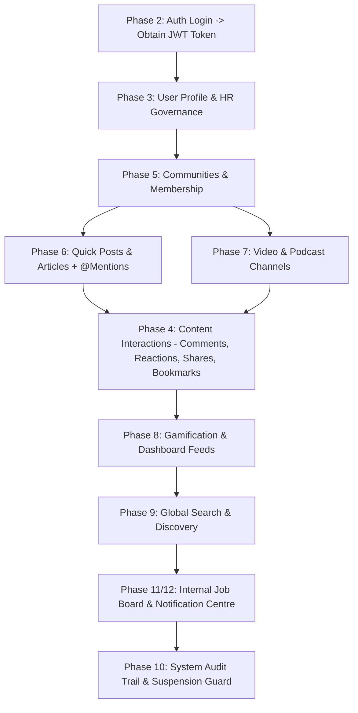

# Knome EEP Portal — Comprehensive API Testing Guide (Manual Swagger UI Verification)

**Version**: `v1.2.1` (Production Ready - Patched & Hardened)  
**Target Environment**: Local Development (`http://localhost:5095/swagger`)  
**Architecture**: ASP.NET Core 10 Web API (`net10.0`) + Entity Framework Core (`Database-First`)  

---

## Table of Contents
1. [Overview & Environment Setup](#1-overview--environment-setup)
2. [Authentication Process & Safe Test Credentials](#2-authentication-process--safe-test-credentials)
3. [Recommended API Execution Order & Workflow Dependencies](#3-recommended-api-execution-order--workflow-dependencies)
4. [Master Endpoint Directory & Verification Manual (All 14 Controllers)](#4-master-endpoint-directory--verification-manual)
   - [4.1 AuthController (`/api/auth`)](#41-authcontroller)
   - [4.2 UserController (`/api/users`)](#42-usercontroller)
   - [4.3 CommunityController (`/api/communities`)](#43-communitycontroller)
   - [4.4 PostController (`/api/posts`)](#44-postcontroller)
   - [4.5 ArticleController (`/api/articles`)](#45-articlecontroller)
   - [4.6 VideoController (`/api/videos`)](#46-videocontroller)
   - [4.7 PodcastController (`/api/podcasts`)](#47-podcastcontroller)
   - [4.8 InteractionController (`/api/interactions`)](#48-interactioncontroller)
   - [4.9 KarmaController (`/api/karma`)](#49-karmacontroller)
   - [4.10 FeedController (`/api/feed`)](#410-feedcontroller)
   - [4.11 SearchController (`/api/search`)](#411-searchcontroller)
   - [4.12 JobsController (`/api/jobs`)](#412-jobscontroller)
   - [4.13 AuditLogController (`/api/audit/logs`)](#413-auditlogcontroller)
   - [4.14 NotificationsController (`/api/notifications`)](#414-notificationscontroller)
5. [Indian DPDP Act 2023 Privacy Masking Verification](#5-indian-dpdp-act-2023-privacy-masking-verification)
6. [Real-Time Content Security & Moderation Screening Verification](#6-real-time-content-security--moderation-screening-verification)
7. [Troubleshooting & Common API Errors](#7-troubleshooting--common-api-errors)

---

## 1. Overview & Environment Setup

This guide provides step-by-step instructions for testing every endpoint across all **14 API Controllers** in the Knome Enterprise Engagement Portal backend using the built-in Swagger UI. No source code inspection is required.

### 1.1 Starting the Server
Open a terminal in the project directory and launch the API:
```powershell
cd "d:\Knome Final\Backend\Knome.API"
dotnet run
```
Once started, open Microsoft Edge or Chrome and navigate to:
👉 **`http://localhost:5095/swagger`** *(or visit `http://localhost:5095/`, which automatically redirects to `/swagger`)*.

### 1.2 Unified Response Envelope Architecture (`ApiResponse<T>`)
Every endpoint in `Knome.API` returns a consistent JSON envelope:
```json
{
  "success": true,
  "statusCode": 200,
  "message": "Operation completed successfully.",
  "data": { ... }
}
```
If an error occurs (e.g. invalid input, authorization failure, resource not found), `success` is `false`, `data` is `null`, and `message` contains the human-readable explanation.

---

## 2. Authentication Process & Safe Test Credentials

The backend uses **Stateless HS256 JWT Bearer Tokens** with `BCrypt` password hashing (`work factor 11`). 

### 2.1 Safe Test Credentials Matrix
To test endpoints that require specific enterprise roles (`Employee`, `Community Admin`, `HR Administrator`, `System Administrator`), use the following accounts. All test accounts share the safe seed password: **`Password@123`**.

| Employee ID | Password | Assigned Roles | Primary Testing Purpose |
| :--- | :--- | :--- | :--- |
| **`EMP001`** | `Password@123` | `Employee` | Standard employee self-service, content posting, commenting, joining communities, applying for jobs. |
| **`EMP002`** | `Password@123` | `Employee`, `Community Admin` | Community management, approving join requests, pinning posts, promoting moderators. |
| **`EMP003`** | `Password@123` | `Employee`, `HR Administrator` | Department/role assignment, employee suspension/activation, creating internal job postings, broadcasting HR announcements. |
| **`EMP004`** | `Password@123` | `Employee`, `System Administrator` | Viewing global audit logs (`GET /api/audit/logs`), system-level broadcasts, job board governance. |

> [!TIP]
> **Safe Database Seeding / Reset**: If these test accounts do not exist in your local SQL Server instance (`Knome` database), execute the safe T-SQL script [Documentation/Seed_Test_Credentials.sql](file:///d:/Knome%20Final/Documentation/Seed_Test_Credentials.sql) in SQL Server Management Studio (SSMS) or `sqlcmd`. It safely creates or resets all 4 accounts without altering any existing data.

### 2.2 How to Authenticate in Swagger UI
1. Expand **`POST /api/auth/login`** in Swagger UI and click **Try it out**.
2. Enter the login payload for `EMP001` (or the role you need):
   ```json
   {
     "employeeId": "EMP001",
     "password": "Password@123"
   }
   ```
3. Click **Execute**. From the `200 OK` response JSON, copy the `"token"` string (without quotes).
4. Scroll to the top of the Swagger UI page and click the green **Authorize 🔒** button.
5. In the **Value** field, type `Bearer ` followed by your copied token:
   ```http
   Bearer eyJhbGciOiJIUzI1NiIsInR5cCI6IkpXVCJ9...
   ```
6. Click **Authorize** and then **Close**. All subsequent requests will automatically include this JWT header!

---

## 3. Recommended API Execution Order & Workflow Dependencies

Because EEP workflows are highly relational, test the API modules in this sequential order so that required foreign IDs (`UserId`, `CommunityId`, `PostId`, `ArticleId`, `SeriesId`, `JobId`) are generated before downstream endpoints consume them:



---

## 4. Master Endpoint Directory & Verification Manual

### 4.1 AuthController
Exposes stateless authentication and SSO-ready extension boundaries.

#### `POST /api/auth/login`
- **Authorization**: `[AllowAnonymous]`
- **Prerequisites**: None.
- **Request Payload**:
  ```json
  {
    "employeeId": "EMP001",
    "password": "Password@123"
  }
  ```
- **Expected Outcome (`200 OK`)**:
  ```json
  {
    "success": true,
    "statusCode": 200,
    "message": "Login successful.",
    "data": {
      "token": "eyJhbGciOiJIUzI1Ni...",
      "expiresAt": "2026-07-10T14:30:00Z",
      "user": {
        "userId": 1,
        "employeeId": "EMP001",
        "fullName": "Aarav Sharma (Employee)",
        "email": "emp001.employee@knome.local",
        "roles": ["Employee"]
      }
    }
  }
  ```
- **Verification Step**: Copy `data.token`, click **Authorize 🔒** at the top of Swagger UI, and enter `Bearer <token>`.

---

### 4.2 UserController
Manages employee self-service profile updates, Indian DPDP Act visibility masking, and HR administrative governance.

#### `GET /api/users/profile`
- **Authorization**: `[Authorize]` (Any role)
- **Prerequisites**: Authenticated as `EMP001`.
- **Expected Outcome (`200 OK`)**: Returns current user's complete profile including `bioVisibility`, `skills`, `interests`, `followersCount`, `followingCount`, and `karmaPoints`.

#### `PUT /api/users/profile`
- **Authorization**: `[Authorize]` (Self-Service)
- **Request Payload**:
  ```json
  {
    "bio": "Passionate ASP.NET Core 9 Architect building the Knome EEP module.",
    "bioVisibility": "Private",
    "networkVisibility": "Public",
    "photosVisibility": "Public",
    "interestsVisibility": "Public",
    "mobileNo": "+91-9876543210",
    "skills": ["C#", ".NET 9", "EF Core", "System Architecture"],
    "interests": ["Cloud Computing", "AI/ML", "Microservices"]
  }
  ```
- **Expected Outcome (`200 OK`)**: Profile updated. Note down that `bioVisibility` is set to `"Private"`.

#### `GET /api/users/{id}`
- **Authorization**: `[Authorize]` (Any role)
- **Prerequisites**: Retrieve another user (`e.g., id = 1` while logged in as `EMP002`).
- **Expected Outcome (`200 OK`)**: If viewing a target user whose `bioVisibility` is `"Private"`, the `bio` field will automatically return `"[Private per DPDP Act]"` (or null per visibility rules) unless viewed by an `HR Administrator`.

#### `PUT /api/users/{id}/department`
- **Authorization**: `[Authorize(Policy = Roles.HRAdmin)]` (Requires `EMP003` token)
- **Prerequisites**: Authenticate as `EMP003` (`HR Administrator`). Target `id = 1` (`EMP001`).
- **Request Payload**:
  ```json
  {
    "departmentId": 2,
    "reason": "Internal organizational restructuring"
  }
  ```
- **Expected Outcome (`200 OK`)**: Department changed to ID 2 (`Human Resources`).

#### `PUT /api/users/{id}/roles`
- **Authorization**: `[Authorize(Policy = Roles.HRAdmin)]` (Requires `EMP003` token)
- **Request Payload**:
  ```json
  {
    "roles": ["Employee", "Community Admin"]
  }
  ```
- **Expected Outcome (`200 OK`)**: Target user (`EMP001`) granted `Community Admin` capability.

#### `PUT /api/users/{id}/suspend`
- **Authorization**: `[Authorize(Roles = "HR Administrator,System Administrator")]` (Requires `EMP003` token)
- **Request Payload**:
  ```json
  {
    "isPermanent": false,
    "suspendedUntil": "2026-07-15T00:00:00Z",
    "reason": "Temporary suspension for compliance review"
  }
  ```
- **Expected Outcome (`200 OK`)**: User suspended. An immutable record is automatically recorded in the `AuditLog` table.

#### `PUT /api/users/{id}/activate`
- **Authorization**: `[Authorize(Roles = "HR Administrator,System Administrator")]` (Requires `EMP003` token)
- **Request Payload**: None (Empty body)
- **Expected Outcome (`200 OK`)**: User reactivated.

---

### 4.3 CommunityController
Manages Public, Private, and Default spaces, join workflows, member moderation, and pinning.

#### `POST /api/communities`
- **Authorization**: `[Authorize]` (Any role — creator becomes first Community Admin)
- **Prerequisites**: Authenticate as `EMP001`.
- **Request Payload**:
  ```json
  {
    "name": "Cloud Native Architecture Forum",
    "description": "Deep dive discussions on Kubernetes, Docker, and .NET Microservices.",
    "privacyType": "Public",
    "category": "Technology",
    "rules": "Be respectful and stay on topic."
  }
  ```
- **Expected Outcome (`201 Created`)**: Returns community details (`id`, e.g., `1`). Copy `data.id` for subsequent tests.

#### `POST /api/communities/{id}/join`
- **Authorization**: `[Authorize]`
- **Prerequisites**: Authenticate as `EMP002` (`id = 2`), call `/api/communities/1/join`.
- **Expected Outcome (`200 OK`)**: For `Public` communities, status returns `"Approved"` and user joins immediately. For `Private` communities, status returns `"Pending"` and a real-time bell notification is broadcast to the Community Admins (`NotificationTypes.CommunityJoin`).

#### `PUT /api/communities/{id}/members/{userId}/status`
- **Authorization**: `[Authorize]` (Must be Community Admin of `{id}`)
- **Prerequisites**: Authenticate as `EMP001` (creator/admin of community 1). Approve pending `userId = 2`.
- **Request Payload**:
  ```json
  {
    "status": "Approved"
  }
  ```
- **Expected Outcome (`200 OK`)**: Member status updated to `"Approved"`. A notification (`NotificationTypes.CommunityJoin`) is sent to `EMP002`.

#### `POST /api/communities/{id}/admins/{userId}`
- **Authorization**: `[Authorize]` (Must be Community Admin of `{id}`)
- **Prerequisites**: Authenticate as `EMP001`. Promote `userId = 2` (`EMP002`) to admin.
- **Expected Outcome (`200 OK`)**: Member promoted to `Community Admin`. A notification (`NotificationTypes.CommunityInvite`) is triggered.

#### `POST /api/communities/{id}/pin/{postId}`
- **Authorization**: `[Authorize]` (Must be Community Admin of `{id}`)
- **Prerequisites**: Create a post inside Community 1 first (see section 4.4).
- **Expected Outcome (`200 OK`)**: Post pinned to top of community feed (`IsPinned = true`). If 3 posts are already pinned, returns `400 Bad Request` enforcing the business rule (`FR-CM-06`).

---

### 4.4 PostController
Handles quick-share posts (max 400 chars), `@Mentions` join table mapping, and community feed items.

#### `POST /api/posts`
- **Authorization**: `[Authorize]`
- **Prerequisites**: Authenticated as `EMP001`.
- **Request Payload**:
  ```json
  {
    "contentText": "Excited to launch the new microservices portal! @EMP002 check this out!",
    "audienceType": "Community",
    "communityId": 1,
    "mentionedUserIds": [2]
  }
  ```
- **Expected Outcome (`201 Created`)**: Post created (`id = 1`). `PostMentions` join table populated with `(PostId: 1, MentionedUserId: 2)`. Real-time bell notification (`NotificationTypes.Mention`) published to `EMP002`.

#### `GET /api/posts/{id}`
- **Authorization**: `[Authorize]`
- **Expected Outcome (`200 OK`)**: Returns post with full author details, mentioned user summaries, attachment counts, and real-time interaction summaries (comments, reactions, shares, bookmarks).

---

### 4.5 ArticleController
Manages deep-dive technical blogging, category mapping, version auditing (`ArticleVersions`), and view counts.

#### `POST /api/articles`
- **Authorization**: `[Authorize]`
- **Prerequisites**: Authenticated as `EMP001`.
- **Request Payload**:
  ```json
  {
    "title": "Mastering Entity Framework Core 9 Performance",
    "description": "Comprehensive guide on Compiled Queries, Split Queries, and NoTracking.",
    "contentHtml": "<h2>Introduction</h2><p>In this high-performance guide for ASP.NET Core 9, we explore exact database profiling...</p>",
    "categoryId": 1,
    "tags": [".NET 9", "EF Core", "Performance", "Database"]
  }
  ```
- **Expected Outcome (`201 Created`)**: Article created (`id = 1`) with estimated `avgReadTimeSeconds` (calculated automatically from word count).

#### `PUT /api/articles/{id}`
- **Authorization**: `[Authorize]` (Must be Author)
- **Request Payload**:
  ```json
  {
    "title": "Mastering Entity Framework Core 9 Performance (v2)",
    "description": "Updated with real-world SQL execution logs.",
    "contentHtml": "<h2>Introduction</h2><p>In this high-performance guide for ASP.NET Core 9, we explore exact database profiling and benchmark results...</p>",
    "categoryId": 1,
    "tags": [".NET 9", "EF Core", "Benchmarks"]
  }
  ```
- **Expected Outcome (`200 OK`)**: Because `contentHtml` changed, `ArticleService` automatically records an immutable snapshot in `ArticleVersions` before applying edits (`FR-AB-02`).

*(Note: Article versions are retrieved embedded directly in the `versions` array of the article detail payload via `GET /api/articles/{id}`. There is no standalone `/versions` sub-route in the live API.)*

---

### 4.6 VideoController
Manages enterprise video channels (`<= 500 MB` check, Stream/OneDrive embedding, `VideoTags`).

#### `POST /api/videos`
- **Authorization**: `[Authorize]`
- **Request Payload**:
  ```json
  {
    "title": "Townhall Q3 Architectural Vision",
    "description": "Streamed live from Bhopal HQ covering our next-gen data pipeline.",
    "videoUrl": "https://company.sharepoint.com/videos/q3-townhall.mp4",
    "sourceType": "Stream",
    "durationSeconds": 3600,
    "fileSizeBytes": 250000000,
    "thumbnailUrl": "https://company.sharepoint.com/thumbs/q3.jpg",
    "tags": ["Townhall", "Architecture", "Leadership"]
  }
  ```
- **Expected Outcome (`201 Created`)**: Video published (`id = 1`). If `fileSizeBytes > 524288000` (500 MB), returns `400 Bad Request` (`FR-VC-01`).

---

### 4.7 PodcastController
Manages audio series definitions (`PodcastSeries`) and individual episodes (`<= 100 MB`).

#### `POST /api/podcasts/series`
- **Authorization**: `[Authorize]`
- **Request Payload**:
  ```json
  {
    "title": "The Knome Tech Pulse",
    "description": "Weekly interviews with principal engineers and data scientists.",
    "category": "Leadership",
    "coverImageUrl": "/uploads/podcasts/pulse_cover.jpg"
  }
  ```
- **Expected Outcome (`201 Created`)**: Series created (`id = 1`).

#### `POST /api/podcasts/series/{seriesId}/episodes`
- **Authorization**: `[Authorize]`
- **Prerequisites**: `seriesId = 1`.
- **Request Payload**:
  ```json
  {
    "title": "Episode 1: AI Agents in Production",
    "description": "Discussing advanced code generation and semantic search.",
    "audioUrl": "https://company.sharepoint.com/podcasts/ep1.mp3",
    "durationSeconds": 1800,
    "fileSizeBytes": 45000000
  }
  ```
- **Expected Outcome (`201 Created`)**: Episode added (`id = 1`). Series `episodeCount` incremented automatically. If `fileSizeBytes > 104857600` (100 MB), returns `400 Bad Request` (`FR-PD-02`).

---

### 4.8 InteractionController
Delegates polymorphic engagement (`Post`, `Article`, `Video`, `Podcast`) across 4 separate entities (`Comment`, `Reaction`, `Share`, `Bookmark`) and security/moderation checks.

#### `POST /api/interactions/comments`
- **Authorization**: `[Authorize]`
- **Request Payload**:
  ```json
  {
    "contentType": "Post",
    "contentId": 1,
    "commentText": "This architecture looks fantastic! Can we schedule a walkthrough?"
  }
  ```
- **Expected Outcome (`201 Created`)**: Comment persisted (`id = 1`). Author of `Post 1` receives real-time notification (`NotificationTypes.Comment`).

#### `POST /api/interactions/reactions`
- **Authorization**: `[Authorize]`
- **Request Payload**:
  ```json
  {
    "contentType": "Post",
    "contentId": 1,
    "reactionType": "Insightful"
  }
  ```
- **Expected Outcome (`200 OK`)**: Reaction recorded (`Insightful`). If executed again by the same user with the same reaction type, it toggles off (`deleted`) or updates cleanly (`upsert`).

#### `POST /api/interactions/moderation/screen`
- **Authorization**: `[Authorize]` (Diagnostic check for `BlockedUrls` & `RestrictedKeywords`)
- **Request Payload**:
  ```json
  {
    "contentText": "Check out this suspicious site at http://malware.example.com and restricted keywords!"
  }
  ```
- **Expected Outcome (`200 OK`)**:
  ```json
  {
    "success": true,
    "data": {
      "isSafe": false,
      "violations": ["Contains blocked URL: malware.example.com"]
    }
  }
  ```

---

### 4.9 KarmaController
Exposes employee gamification points (`TotalPoints`), threshold badges, transaction histories, and leaderboards.

#### `GET /api/karma/{userId}`
- **Authorization**: `[Authorize]`
- **Expected Outcome (`200 OK`)**: Returns user's `totalPoints` and calculated `badgeLevel` (`Bronze` < 100, `Silver` < 500, `Gold` < 1500, `Platinum` >= 1500).

#### `GET /api/karma/leaderboard?limit=10`
- **Authorization**: `[Authorize]`
- **Expected Outcome (`200 OK`)**: Returns top employees ranked by `totalPoints` descending.

---

### 4.10 FeedController
Exposes personalized home feeds, hot posts ranking engine (`HotPostsScoreCache`), and unified dashboard summaries.

#### `GET /api/feed/home?page=1&pageSize=10`
- **Authorization**: `[Authorize]`
- **Expected Outcome (`200 OK`)**: Returns paginated posts and articles from communities the current user has joined (`Approved`) or created.

#### `GET /api/feed/hot?page=1&pageSize=10`
- **Authorization**: `[Authorize]`
- **Expected Outcome (`200 OK`)**: Returns trending content ranked by the exact time-decay formula (`FR-HP-01`): `Score = (C*3 + R*1 + S*4) / (AgeInHours + 2)^1.5`.

#### `GET /api/feed/dashboard`
- **Authorization**: `[Authorize]`
- **Expected Outcome (`200 OK`)**: Returns unified dashboard envelope with `trendingPosts`, `myCommunities`, `unreadNotificationCount`, and `myKarmaSummary`.

---

### 4.11 SearchController
Exposes polymorphic search across 7 domains (`Users`, `Communities`, `Posts`, `Articles`, `Videos`, `Podcasts`, `Jobs`) and search history.

#### `GET /api/search?q=Architecture&domain=All&sortBy=Relevance&page=1&pageSize=10`
- **Authorization**: `[Authorize]`
- **Expected Outcome (`200 OK`)**: Returns unified search envelope with result arrays across all matching entities (`users`, `communities`, `posts`, `articles`, `videos`, `podcasts`, `jobs`). Automatically logs the query in `SearchHistory` (`FR-SD-05`).

#### `GET /api/search/history`
- **Authorization**: `[Authorize]`
- **Expected Outcome (`200 OK`)**: Returns recent search keywords queried by the current user.

---

### 4.12 JobsController
Manages internal job postings (`HR/System Admin` only for create/update/delete; open to all employees for discovery).

#### `POST /api/jobs`
- **Authorization**: `[Authorize(Policy = Roles.HRAdmin)]` (Requires `EMP003` or `EMP004`)
- **Request Payload**:
  ```json
  {
    "title": "Lead Cloud Solution Architect",
    "description": "Looking for a senior architect to lead our multi-region Azure adoption.",
    "departmentId": 1,
    "location": "Bhopal HQ / Hybrid",
    "skillsRequired": "Azure, C#, Kubernetes, Microservices",
    "closingDate": "2026-12-31T23:59:59Z",
    "applicationLink": "https://internal.knome.local/careers/job-101",
    "status": "Open"
  }
  ```
- **Expected Outcome (`201 Created`)**: Job posted (`id = 1`). A broadcast bell notification (`NotificationTypes.Job`) is published to all active employees whose Job bell preference is enabled (`FR-JB-04`).

#### `GET /api/jobs?departmentId=1&status=Open&search=Architect`
- **Authorization**: `[Authorize]` (Any employee)
- **Expected Outcome (`200 OK`)**: Returns filtered, non-expired open job postings.

---

### 4.13 AuditLogController
Exposes immutable system governance logs to `System Administrators`.

#### `GET /api/audit/logs?entityName=User&page=1&pageSize=20`
- **Authorization**: `[Authorize(Policy = Roles.SystemAdmin)]` (Requires `EMP004` token)
- **Expected Outcome (`200 OK`)**: Returns chronological audit records showing action (`UserSuspended`, `UserActivated`, etc.), actor (`PerformedByUserId`), target ID, IP address, and details. If accessed by `EMP001` (`Employee`), returns `403 Forbidden`.

---

### 4.14 NotificationsController
Exposes real-time event-driven notifications (`FR-NT`), unread counters, preference toggles (`BellEnabled` / `EmailEnabled`), and HR broadcasts.

#### `GET /api/notifications?unreadOnly=true&page=1&pageSize=15`
- **Authorization**: `[Authorize]`
- **Expected Outcome (`200 OK`)**: Returns paginated notifications triggered by comments, mentions, community approvals, jobs, and broadcasts.

#### `GET /api/notifications/unread-count`
- **Authorization**: `[Authorize]`
- **Expected Outcome (`200 OK`)**: Returns exact integer count of unread bell notifications (`"data": 3`).

#### `POST /api/notifications/{id}/read`
- **Authorization**: `[Authorize]`
- **Expected Outcome (`200 OK`)**: Marks specific notification as read (`IsRead = true`, `ReadDate = DateTime.UtcNow`).

#### `POST /api/notifications/read-all`
- **Authorization**: `[Authorize]`
- **Expected Outcome (`200 OK`)**: Marks every unread notification belonging to the current user as read in a single batch.

#### `PUT /api/notifications/preferences`
- **Authorization**: `[Authorize]`
- **Request Payload**:
  ```json
  {
    "eventType": "Job",
    "bellEnabled": false,
    "emailEnabled": true
  }
  ```
- **Expected Outcome (`200 OK`)**: Updates preference row. Future `Job` notifications will skip this user's bell alerts while maintaining email preference (`FR-NT-03`).

#### `POST /api/notifications/broadcast`
- **Authorization**: `[Authorize(Roles = "HR Administrator,System Administrator")]` (Requires `EMP003` or `EMP004`)
- **Request Payload**:
  ```json
  {
    "title": "Mandatory Security Awareness Training",
    "message": "Please complete the Annual DPDP Act 2023 compliance training by Friday.",
    "relatedContentType": "Announcement",
    "relatedContentId": null
  }
  ```
- **Expected Outcome (`200 OK`)**: Broadcast notification dispatched to every active employee (`NotificationTypes.HrAnnouncement`).

---

## 5. Indian DPDP Act 2023 Privacy Masking Verification

To manually verify compliance with the **Digital Personal Data Protection Act (DPDP Act 2023)**:
1. Log in as **`EMP001`**. Call `PUT /api/users/profile` and set `"bioVisibility": "Private"`.
2. Log in as **`EMP002`** (`Community Admin / Employee`). Call `GET /api/users/1` (viewing `EMP001`'s profile).
3. **Verify**: Check the JSON response for `EMP001`. Because `bioVisibility` is `"Private"`, the `bio` field will be automatically masked (`"[Private per DPDP Act]"` or omitted).
4. Log in as **`EMP003`** (`HR Administrator`). Call `GET /api/users/1`.
5. **Verify**: Because `HR Administrators` have enterprise governance override rights, `EMP003` can read the full unmasked `bio`.

---

## 6. Real-Time Content Security & Moderation Screening Verification

To verify that the automated moderation engine screens URLs and restricted keywords:
1. Log in as **`EMP001`**. Call `POST /api/posts` with the following payload:
   ```json
   {
     "contentText": "Download our unofficial tool from http://malware.example.com right now!",
     "audienceType": "Everyone"
   }
   ```
2. **Verify**: The API immediately intercepts the request prior to database saving and returns **`400 Bad Request`**:
   ```json
   {
     "success": false,
     "statusCode": 400,
     "message": "Content failed security screening. Contains blocked URL: malware.example.com",
     "data": null
   }
   ```
3. Test with clean text (`"Download our official tool from SharePoint!"`) -> Returns `201 Created`.

---

## 7. Troubleshooting & Common API Errors

| HTTP Status Code | Common Cause | How to Resolve in Swagger UI |
| :---: | :--- | :--- |
| **`401 Unauthorized`** | Missing or expired JWT token. | Click **Authorize 🔒** at the top of Swagger UI. Ensure you entered `Bearer <token>` with a valid, non-expired token. |
| **`403 Forbidden`** | User authenticated, but lacks the role required by `[Authorize(Policy = Roles.HRAdmin)]` or `SystemAdmin`. | Log out and obtain a JWT token for the appropriate test account (`EMP003` for HR, `EMP004` for SysAdmin, `EMP002` for Community Admin). |
| **`400 Bad Request`** | Input validation failure (FluentValidation rule violation or business check like file size > 500 MB). | Check the `message` and `errors` array in the JSON response envelope. Correct the payload fields (e.g., ensure `closingDate` is in the future). |
| **`404 Not Found`** | Resource ID does not exist in the SQL database or wrong endpoint URL. | Verify the `id` parameter in the URL path (`/api/posts/999`). If accessing `http://localhost:5095/`, remember root automatically redirects to `/swagger`. |
