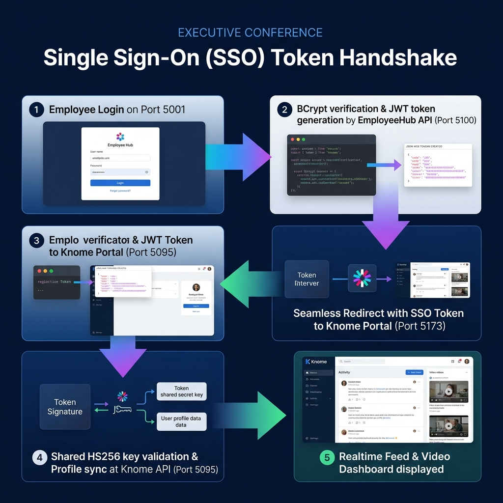
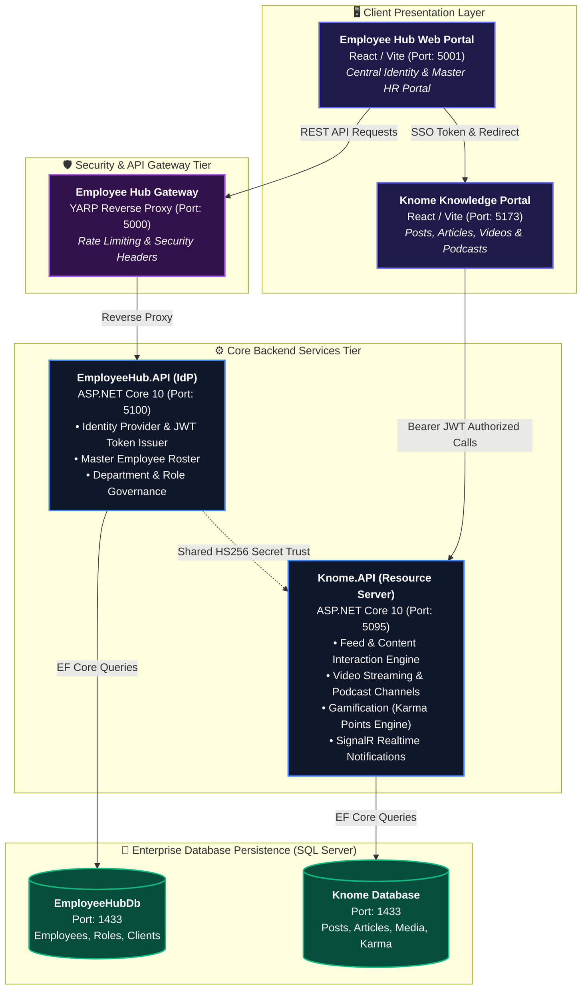
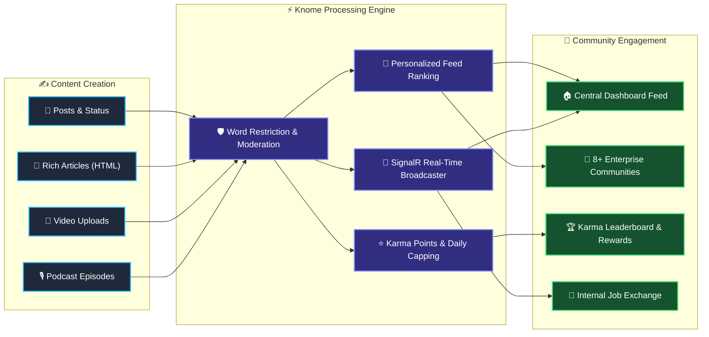
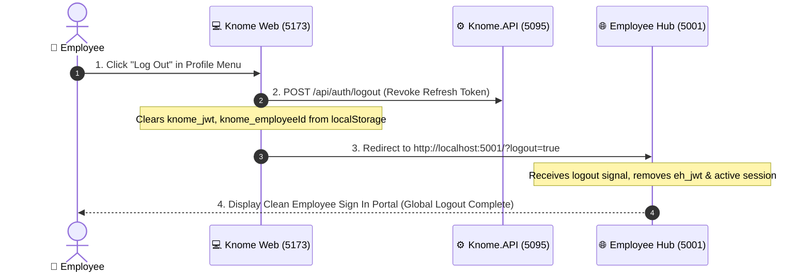

# 🏛️ Knome Platform & Employee Hub: Enterprise Architecture Presentation

**Organization:** MPOnline Limited  
**Platform:** Knome Enterprise Knowledge & Media Platform + Employee Hub SSO  
**Architecture Standard:** 6-Layer Enterprise Distributed Architecture  

---

## 📊 1. Knome 6-Tier System Architecture Diagram

---

## 🏛️ 2. Knome & Employee Hub Ecosystem Architecture

---

## 🔄 3. Single Sign-On (SSO) Token Handshake Flow

---

## 1. High-Level Enterprise Ecosystem Architecture

---

## 2. Knome Core Content & Media Engine

---

## 3. Single Sign-Out (Global Logout) Orchestration

---

## 4. Key Architecture Highlights for Meeting Presentation

### 1. 🔐 Security & Identity Federation
- **Decoupled Identity Provider (IdP)**: Authentication is centralized in Employee Hub, removing duplicate credential management.
- **JWT (HS256) Shared Key**: Cryptographic signature validation with role claims (`System Administrator`, `Community Admin`, `HR Administrator`, `Employee`).
- **Zero Raw Password Storage**: Passwords hashed using standard BCrypt (Work Factor 11).

### 2. ⚡ Resilient & High Performance
- **Client Resiliency & Offline Fallback**: Frontend handles network dropouts gracefully without crashing.
- **Rate Limiting & DDoS Protection**: AspNetCore Rate Limiting on critical endpoints.
- **Clean Architecture Separation**: Controllers (Thin HTTP routers) ➔ Services (Business Logic) ➔ Repositories (Data Access) ➔ SQL Server.

### 3. 🎮 Enterprise Gamification & Real-Time Sync
- **Automated Karma Points Engine**: Points for content creation (+10 for Articles, +8 for Media, +2 for Posts) with daily anti-spam capping.
- **SignalR Push Notifications**: Live notification delivery for comments, likes, and official broadcasts.
