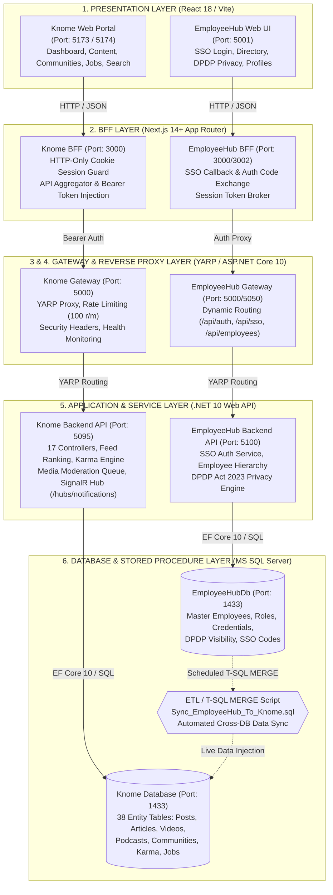

# KNOME & EMPLOYEEHUB — ENTERPRISE SOLUTION ARCHITECTURE (6-LAYER)

**Organization**: MPOnline Limited  
**Target Runtime**: ASP.NET Core 10.0 (`net10.0`) + Next.js 14+ (App Router) + React 18 / Vite  
**Database**: Microsoft SQL Server 2022 (`Knome` & `EmployeeHubDb`)  
**Architecture Classification**: 6-Tier Distributed Enterprise Monolith & Identity Broker Ecosystem  

---

## 1. Executive Summary & Architectural Overview

The **Knome Enterprise Excellence Platform** and **EmployeeHub** operate in tandem to deliver a secure, high-performance, compliant digital workplace for **MPOnline Limited**.

- **EmployeeHub** functions as the **Master Identity Provider (IdP)** and **Central HRMS Source of Truth**, managing employee records, organizational departments, job designations, DPDP Act 2023 visibility levels, and SSO authentication tokens.
- **Knome** functions as the **Enterprise Knowledge Management, Social Collaboration, and Internal Mobility Portal** (incorporating features inspired by LinkedIn, Medium, and YouTube), providing community hubs, rich media publishing, gamified karma points, real-time push notifications, and internal job boards.

Both platforms strictly follow the **6-Layer Architecture Pattern** shown in the reference solution architecture:



---

## 2. Comprehensive 6-Layer Architecture Breakdown

| Layer | Component Name | Knome Implementation | EmployeeHub Implementation | Port | Core Responsibilities |
| :--- | :--- | :--- | :--- | :--- | :--- |
| **Layer 1** | **Presentation Layer** | React 18, Vite, Tailwind CSS (`knomeUI/frontend`) | React 18, Vite, Tailwind CSS (`src/EmployeeHub.Web`) | **`5173`** (Knome)<br>**`5001`** (EmployeeHub) | Client UI/UX, responsive layouts, forms, live dashboards, media playback, role-based navigation. |
| **Layer 2** | **BFF Layer (Backend for Frontend)** | Next.js 14+ App Router (`Bff/knome-bff`) | Next.js 14+ App Router (`Bff/employeehub-bff`) | **`3000`** | HTTP-Only cookie protection (`knome_token`), Token injection into Gateway headers, API aggregation. |
| **Layer 3** | **API Gateway Layer** | ASP.NET Core 10 Gateway (`Gateway/Knome.Gateway`) | ASP.NET Core 10 Gateway (`Gateway/EmployeeHub.Gateway`) | **`5000`** | Central entry point, security headers (CSP, HSTS, X-Frame), rate limiting, CORS management, `/health` probes. |
| **Layer 4** | **YARP Reverse Proxy Layer** | `Yarp.ReverseProxy` in .NET 10 | `Yarp.ReverseProxy` in .NET 10 | **`5000`** | High-throughput path routing (`/api/v1/*` ➔ backend clusters), load balancing, request transformation. |
| **Layer 5** | **Application & Service Layer** | ASP.NET Core 10 API (`Backend/Knome.API`) | ASP.NET Core 10 Clean Architecture API (`src/EmployeeHub.API`) | **`5095`** (Knome)<br>**`5100`** (EmployeeHub) | Business rules, Feed ranking, Karma gamification, Media approval, SignalR push notifications, SSO Broker. |
| **Layer 6** | **Database & Stored Procedure Layer** | SQL Server `Knome` DB (38 Tables + SPs) | SQL Server `EmployeeHubDb` (10 Entities + MERGE ETL) | **`1433`** | Relational persistence, transactional consistency, stored procedures, automated cross-database MERGE sync. |

---

## 3. Deep Dive into the 6 Architecture Layers

### 🏛️ Layer 1: Presentation Layer (UI & Experience)
- **Knome Portal (`knomeUI/frontend`)**:
  - **Dashboard & Hot Feed**: Infinite scroll, personalized feed using time-decay engagement algorithm.
  - **Profile & Networking**: Badges, karma points, user skills, peer connections, follower graph.
  - **Communities Hub**: Public, Private, and Default department communities with join workflows.
  - **Content Studio**: Multi-media publishing for Posts (images/docs), long-form Articles (rich text + versioning), Videos (upload/MS Stream), and Podcasts (browser audio recording).
  - **Internal Job Postings (IJP)**: Job application pipeline, resume attachments, HR candidate tracking.
  - **Real-Time Alerts**: SignalR connection to `/hubs/notifications` for instant alerts.
- **EmployeeHub Console (`src/EmployeeHub.Web`)**:
  - **Central SSO Login**: Corporate authentication interface.
  - **Employee Directory**: Department tree, organization chart, reporting manager linkage.
  - **DPDP Act 2023 Privacy Controls**: Employee self-service privacy toggles (`Public`, `DepartmentOnly`, `Private`) for Bio, Network, Photos, and Interests.

---

### 🛡️ Layer 2: BFF Layer (Backend for Frontend)
- **Zero Raw Token Exposure**: Raw JWT tokens are NEVER stored in browser `localStorage` or `sessionStorage` (preventing XSS token theft).
- **HTTP-Only Secure Cookie Engine**: Tokens are sealed in `HttpOnly; Secure; SameSite=Lax` cookies by the BFF router.
- **Route Handlers**:
  - `/api/auth/login`: Validates credentials against Gateway and mints secure session cookie.
  - `/api/auth/logout`: Clears session cookie and invalidates session.
  - `/api/proxy/[...path]`: Catch-all proxy extracting the cookie, injecting `Authorization: Bearer <token>`, and forwarding to Gateway.
  - **Aggregation**: Combines multiple micro-calls (e.g. User Profile + Feed + Unread Alerts) into single client-side payloads.

---

### 🌐 Layer 3 & 4: API Gateway & YARP Reverse Proxy
- **Unified Gateway Engine**: Built on ASP.NET Core 10 with Microsoft `Yarp.ReverseProxy`.
- **Core Capabilities**:
  - **Dynamic Route Matching**: Maps client routes (`/api/v1/posts/*`, `/api/v1/articles/*`, `/api/v1/karma/*`, `/api/sso/*`) to downstream clusters.
  - **Rate Limiting**: Sliding window throttling (100 requests / minute per client IP) to block DDoS.
  - **Security Headers Middleware**: Injects strict `Content-Security-Policy`, `X-Content-Type-Options: nosniff`, `X-Frame-Options: DENY`, `Strict-Transport-Security`.
  - **Health Monitoring**: High-frequency `/health` probes verifying backend availability.

---

### ⚙️ Layer 5: Application & Core Business Service Layer (.NET 10)
- **Knome Backend Services**:
  - **Feed Ranking Engine (`FeedService.cs`)**:
    $$\text{HotScore} = \frac{\text{Reactions} \times 1.0 + \text{Comments} \times 2.0 + \text{Shares} \times 3.0 + \text{Bookmarks} \times 2.5}{(\text{AgeHours} + 2)^{1.5}}$$
  - **Karma & Gamification Engine (`KarmaService.cs`)**:
    - Post Creation: +2 pts (Max 10/day) | Article Publishing: +10 pts (Max 30/day)
    - Video Upload: +8 pts | Comment Added: +2 pts | Reaction Received: +1 pt
    - Badge Tiers: Bronze (100+ pts), Silver (500+ pts), Gold (1000+ pts), Platinum (2500+ pts).
  - **Media Approval Workflow**:
    - Employee uploads Audio/Video ➔ Flagged `PendingApproval` ➔ Queued in System Admin Console ➔ Admin Review ➔ Status changed to `Approved` ➔ SignalR notification dispatched to creator.
  - **SignalR Push Notifications (`NotificationHub.cs`)**: Real-time push for reactions, comments, job updates, and broadcast alerts.
- **EmployeeHub Backend Services**:
  - **SSO Broker & OAuth Token Mint**: Issues `SsoAuthCode` for cross-platform login and validates client credentials.
  - **DPDP Act 2023 Enforcement**: Filters outgoing employee fields dynamically based on viewer's role and user's privacy settings.

---

### 🗄️ Layer 6: Database & Stored Procedure / ETL Sync Layer
- **Relational Databases (SQL Server 2022)**:
  - `[EmployeeHubDb]`: Master tables (`Employees`, `Departments`, `Designations`, `Roles`, `EmployeeRoles`, `UserCredentials`, `SsoClientApps`, `SsoAuthCodes`).
  - `[Knome]`: 38 scaffolded entity tables (`Users`, `Posts`, `Articles`, `Videos`, `Podcasts`, `Communities`, `Reactions`, `Comments`, `KarmaBalances`, `KarmaTransactions`, `Jobs`, `Notifications`, `AuditLogs`).
- **Live Cross-Database ETL Sync (`Sync_EmployeeHub_To_Knome.sql`)**:
  - **Step 1: Departments**: MERGE `[EmployeeHubDb].[Departments]` ➔ `[Knome].[Departments]`.
  - **Step 2: Roles**: MERGE `[EmployeeHubDb].[Roles]` ➔ `[Knome].[Roles]`.
  - **Step 3: Users**: MERGE `[EmployeeHubDb].[Employees]` ➔ `[Knome].[Users]` (with DPDP visibility flags & `LastSyncedFromHrmsDate`).
  - **Step 4: Credentials**: MERGE BCrypt `PasswordHash` & `PasswordSalt`.
  - **Step 5: User Roles**: MERGE role mapping assignments.
  - **Step 6 & 7: Skills & Interests**: `CROSS APPLY OPENJSON` unpacking array fields from Employee records into `[Knome].[UserSkills]` and `[Knome].[UserInterests]`.

---

## 4. End-to-End Request Execution Lifecycle

```
[User Browser / Mobile UI]
       │
       ▼ (1) HTTP POST /api/proxy/v1/posts
[Next.js BFF (Layer 2)]
       │ (2) Extracts 'knome_token' from HTTP-only cookie
       │ (3) Injects 'Authorization: Bearer <JWT>'
       ▼
[YARP API Gateway (Layer 3 & 4)]
       │ (4) Applies Rate Limiting & Security Headers
       │ (5) YARP routes to Backend Cluster (http://localhost:5095)
       ▼
[Knome.API Service Layer (Layer 5)]
       │ (6) JWT Signature & RBAC Validation
       │ (7) PostService executes business logic & validation
       │ (8) Awards +2 Karma Points via KarmaService
       │ (9) Broadcasts SignalR notification to community followers
       ▼
[MS SQL Server (Layer 6)]
       │ (10) EF Core 10 / Stored Procedure persists post, attachments & karma
       ▼
[Response JSON (ApiResponse<T>)] ➔ Returned to User (< 300ms)
```

---

## 5. Summary of Quality Attributes & Enterprise Compliance

1. **Sub-second Response Times**: Hot feed calculations, BFF proxying, and YARP routing deliver response times under 300ms.
2. **Bank-Grade Security**: BCrypt (Work Factor 11) for passwords, JWT HS256 tokens, and HTTP-Only SameSite cookies.
3. **Regulatory Compliance**: Complete adherence to **DPDP Act 2023** (Digital Personal Data Protection) with field-level visibility masking.
4. **Resilience & Scalability**: Centralized rate limiting, automated background job expiry cleanup, and isolated database schemas.
5. **Zero Data Drift**: Automated T-SQL MERGE ETL synchronization keeps Knome in continuous lockstep with EmployeeHub HRMS master records.
