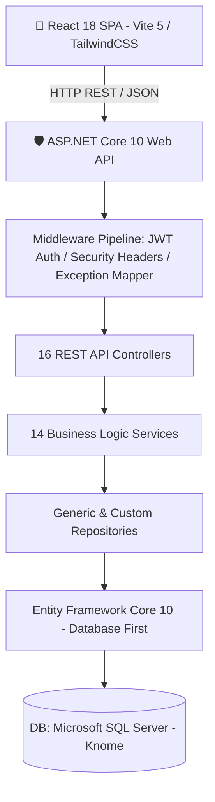
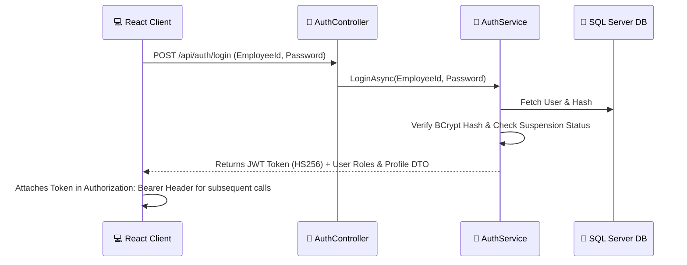
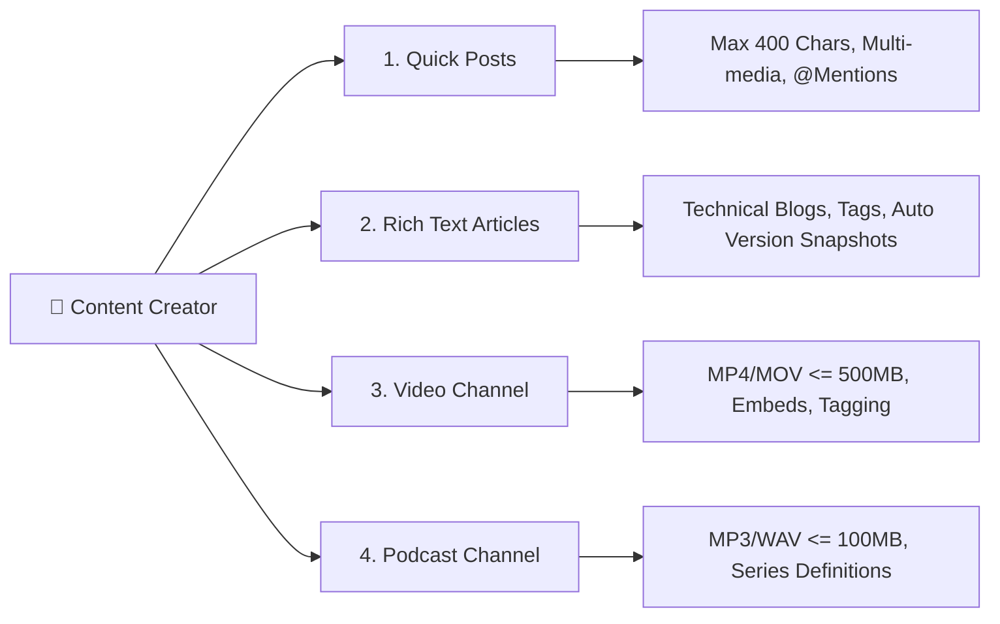
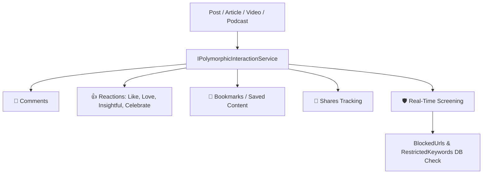
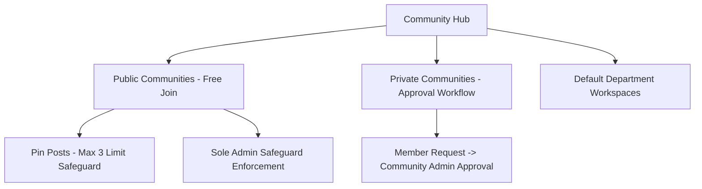
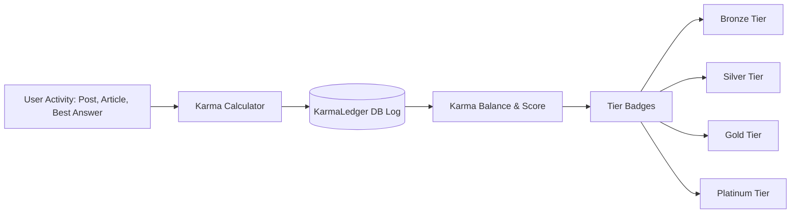
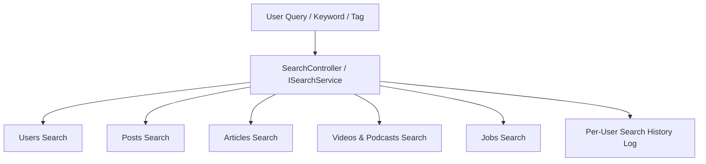
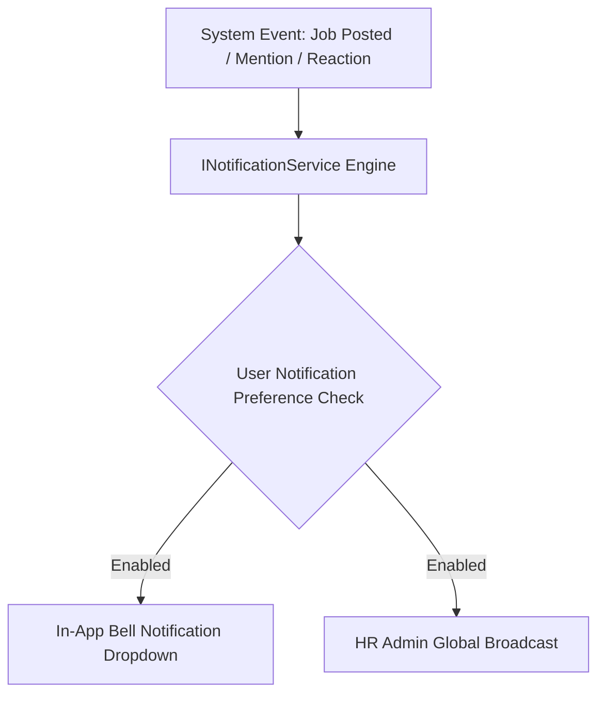
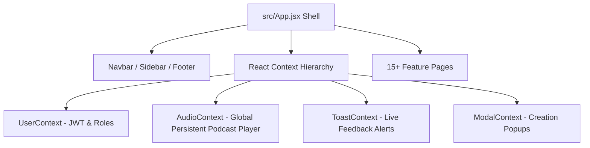

# 📊 Knome Enterprise Knowledge Platform — Project Presentation (PPT)

> **Enterprise Knowledge Management Platform (LinkedIn / Medium / YouTube Hybrid)**  
> **Prepared for**: MPOnline Limit> **Monorepo**: Backend (`Backend/Knome.API` ASP.NET Core 10) + Frontend (`knomeUI/frontend` React 18 / Vite 5)  
> **Current Version**: `v1.2.8` (Backend Frozen) → `v1.3.0` (Full Portal Release)

---

```carousel
# 📌 Slide 1: Executive Summary & Project Vision

## 🚀 Welcome to Knome Platform

**Knome** is an enterprise-grade Knowledge Management & Social Collaboration Portal designed for **MPOnline Limited**. It combines the best capabilities of modern professional platforms:
- **LinkedIn**: Employee networking, activity feed, skills, @mentions, reactions, and internal job board.
- **Medium**: Rich-text technical articles, tag discovery, read-time estimates, and version history.
- **YouTube / Spotify**: Enterprise video streaming channels and persistent global audio podcast player.

### 🎯 Key Objectives & Deliverables
1. **Break Knowledge Silos**: Enable cross-departmental sharing of technical knowledge, ideas, and announcements.
2. **Enterprise Privacy & Security**: Indian DPDP Act 2023 compliance, stateless JWT security, and audit trails.
3. **Employee Engagement**: Gamified Karma points ledger, recognition badges, and trending hot content algorithms.

---
> [!NOTE]
> **Production Baseline**: 100% database-first backend with live SQL Server persistence, verified across 16 REST Controllers and 14 business modules with 0 build errors.

<!-- slide -->

# 🏗️ Slide 2: Full-Stack System Architecture

## 📐 Architecture Blueprint & Technology Stack



### 🛠️ Technology Stack Matrix
| Layer | Framework / Library | Architectural Role |
| :--- | :--- | :--- |
| **Backend API** | ASP.NET Core 10.0 (C# 13) | Enterprise RESTful Web API service delivering high-throughput JSON endpoints |
| **ORM / Data Access** | EF Core 10 (Database-First) | Strongly-typed SQL Server mapping using scaffolded models (`Models/`) |using scaffolded models (`Models/`) |
| **Database Engine** | Microsoft SQL Server | Relational database housing users, posts, media, interactions, karma, & audit logs |
| **Authentication** | JWT (HS256) + BCrypt | Stateless bearer token authentication withsalted password hashing (work factor 11) |
| **Frontend SPA** | React 18 + Vite 5 + TailwindCSS | Single Page Application with dynamic context state and glassmorphic UI components |
| **Validation & Mapping**| FluentValidation + AutoMapper | Automatic request DTO validation and entity-to-DTO object mapping |

<!-- slide -->

# 📁 Slide 3: Backend Clean Architecture Layout

## 🧱 Layer Separation & Design Patterns

The backend follows **Clean Architecture** principles to separate HTTP transport, business rules, and database operations:

```
Backend/Knome.API/
├── Controllers/       # Thin API Endpoints (Routing, Authorization, Request Dispatching)
├── Services/          # Core Business Logic (Karma math, Moderation, Feed ranking, Audit)
├── Repositories/      # Data Access Layer (EF Core LINQ Queries & DbContext abstraction)
├── Models/            # Single Source of Truth (Database-First Scaffolded Entities)
├── DTOs/              # Data Transfer Objects (Decouples API payloads from DB schema)
├── Validators/        # FluentValidation rules intercepting invalid inputs
├── Middleware/        # Security headers, Login rate limiting, Centralized error handling
└── Extensions/        # Dependency Injection & Middleware pipeline setup
```

### 🧠 Core Architectural Guarantees:
- **Thin Controllers**: Controllers contain zero business logic or raw SQL/LINQ queries.
- **Database-First Integrity**: `Models/` and `KnomeDbContext.cs` are 100% scaffolded from SQL Server. Schema changes originate strictly in SQL.
- **Unified Response Envelope**: All API endpoints return a standardized `ApiResponse<T>` wrapper (`Success`, `Message`, `Data`, `Errors`).

<!-- slide -->

# 🔐 Slide 4: Security, Authentication & Role-Based Access Control (RBAC)

## 🛡️ Enterprise Security & Privacy Controls



### 👥 Role-Based Access Control (4 Tier Hierarchy):
1. **`Employee`**: Self-service profile, content creation, community engagement, interactions.
2. **`Community Admin`**: Community governance, member join request approvals, post pinning (max 3).
3. **`HR Administrator`**: Job board management, HR analytics, department changes, broadcast announcements.
4. **`System Administrator`**: System configuration, moderation queue resolution, user suspension, audit logs.

### 🔒 Indian DPDP Act 2023 Compliance:
- Employee self-service privacy controls (`BioVisibility`, `PhotosVisibility`).
- PII Scrubbing enricher in Serilog preventing credential leaks in server logs.

<!-- slide -->

# 📝 Slide 5: Core Content Engines (Posts, Articles & Media)

## 📰 Content Creation & Channel Capabilities



### 🌟 Engine Highlights:
- **Quick-Share Posts (`FR-PC-01..07`)**: Supports `@mentions` dictionary mapping target users directly into EF Core navigation.
- **Article Engine (`FR-AB-01..07`)**: Automatic `ArticleVersions` audit snapshots generated whenever article HTML content is modified.
- **Media Channels (`FR-VC-01..06`, `FR-PD-01..05`)**: Enforces file size limits in FluentValidation and calculates stream view counts (`ViewCount + 1`).

<!-- slide -->

# 💬 Slide 6: Polymorphic Content Interaction & Moderation

## ⚡ Unified Interaction Engine & Screening

All content types (**Post**, **Article**, **Video**, **Podcast**) delegate interaction metrics to a single polymorphic service (`IContentInteractionService`):



### 🛡️ Automated Content Screening:
- Posts, articles, and media titles are screened in real-time against `BlockedUrls` and `RestrictedKeywords`.
- Users can submit moderation reports, populating the Admin Moderation Queue for review.

<!-- slide -->

# 👥 Slide 7: Communities & Governance

## 🏛️ Public, Private & Departmental Workspaces



### Key Features:
- **Flexible Workspace Access**: Employees can explore public technical channels or request access to private project groups.
- **Pinned Posts Safeguard**: Limits pinned community posts to a maximum of 3 to keep top feeds clean.
- **Sole Admin Safeguard**: Prevents the last admin of a community from resigning without designating a successor.

<!-- slide -->

# 🏆 Slide 8: Gamification Engine & Karma Points

## 🏅 Employee Recognition & Badging System

Knome incentivizes knowledge sharing through a dynamic **Karma Ledger Engine**:



### Karma Rules & Admin Rewards:
- **Activity Rules**: Automatic points awarded for writing published articles, receiving reactions, and participating in discussions.
- **System Admin Award**: System Administrators can manually award recognition points to top contributors (`POST /api/karma/award`).

<!-- slide -->

# 🔍 Slide 9: Global Search & Discovery Engine

## 🔎 Unified Enterprise Search Engine



### Features:
- **Multi-Entity Unified Search**: Single query searches across 7 distinct entity types simultaneously.
- **Dynamic Filters**: Filter results by Date Range, Department, Content Category, or Tag.
- **Search History**: Saves user search history (`FR-SD-05`) with one-click clear options.

<!-- slide -->

# 🔔 Slide 10: Internal Jobs, Notifications & Governance

## 💼 Mobility Board & Generic Notification Engine



### Modules Overview:
- **Internal Job Board (`FR-JB-01..05`)**: HR/System Admins post internal openings (`201 Created`). Automatic background service (`JobExpiryHostedService`) handles auto-expiry.
- **Generic Notification Engine (`FR-NT-01..04`)**: Event-driven notification publisher handling bell notifications and broadcast announcements.
- **Audit Trail (`FR-SM-05`)**: Immutable system audit log recording all user suspensions, role changes, and admin governance actions.

<!-- slide -->

# 💻 Slide 11: Frontend UI Architecture & Global State

## 🎨 Modern SPA Experience (`knomeUI/frontend`)



### Visual & UX Standards:
- **Aesthetic Excellence**: Vibrant HSL colors, dark mode support, and smooth micro-animations.
- **Global Podcast Bar**: Podcast playback persists seamlessly across page navigation via `AudioContext`.
- **Axios Interceptor Layer**: Unified HTTP client automatically handles `Bearer` token injection and unwraps `ApiResponse<T>`.

<!-- slide -->

# 🏁 Slide 12: Production Verification & Release Roadmap

## 🚀 Quality Assurance & Handover Status

```
Backend API (ASP.NET Core 10)     React Frontend (knomeUI)
[v1.2.8 Frozen & Production-Hardened] ──► [v1.3.0 Full Integration Target]
  ├── 0 Build Errors / 0 Warnings         ├── 15+ Feature Screens Ready
  ├── 100% DI Verification (14/14)        ├── Axios Interceptors Configured
  └── Live SQL Server Verification        └── 14-Day Day-by-Day Handoff Plan
```

### 🧪 Automated Backend Verification Suites (`scratch/`):
```powershell
# Run DI & Controller Verification
dotnet run --project "Tools/VerifyDiResolvers/VerifyDiResolvers.csproj"

# Run Authentication & Live DB Verification
dotnet run --project "scratch/VerifyAuth/VerifyAuth.csproj"
```

---

### 🎉 Conclusion
The **Knome Platform** backend is fully built, hardened, and verified. Following the 14-Day Implementation Plan will deliver a complete, state-of-the-art enterprise knowledge portal for **MPOnline Limited**.
````
