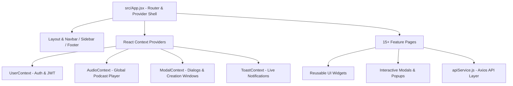
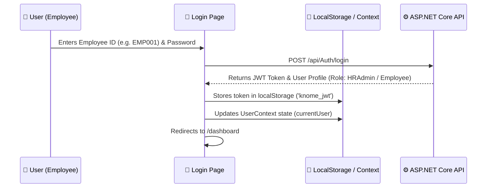
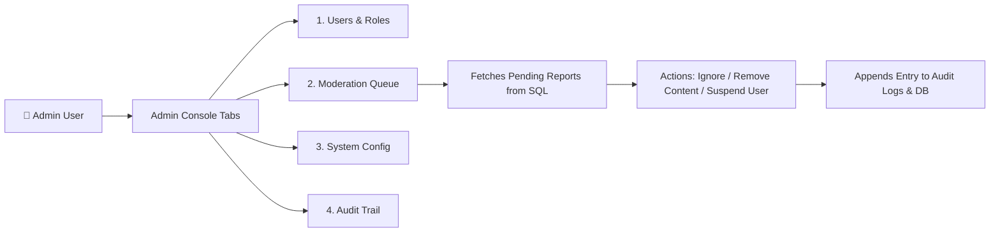

# 🎨 Knome Platform - Frontend Architecture & Feature PPT Presentation

Welcome to the complete, easy-to-understand **Presentation (PPT)** for the **Knome Frontend Application** (`knome-web`). This presentation explains every single part of the frontend in simple language with diagrams, component breakdowns, and real-world workflows.

---

````carousel
# 📌 Slide 1: Knome Frontend Overview & Tech Stack

## 🚀 Welcome to Knome Frontend Architecture

Knome is an enterprise knowledge-sharing social platform (Hybrid of LinkedIn, Medium, and YouTube) built specifically for **MPOnline Limited**.

### 🛠️ Core Technology Stack
| Layer / Tech | Purpose & Role in Knome |
| :--- | :--- |
| **React 18** | UI Library for building interactive, component-based user interfaces |
| **Vite 5** | Lightning-fast build tool and local development server (`npm run dev`) |
| **Tailwind CSS + Custom CSS** | Design system with custom variables, smooth glassmorphism, and responsive design |
| **React Router v6** | Single Page Application (SPA) client-side routing |
| **SignalR Client** | WebSockets client for live real-time notifications (`/hubs/notifications`) |
| **Axios (`apiClient.js`)** | HTTP client with automatic JWT bearer token injection & response unwrapping |

---
> [!TIP]
> **Key Takeaway:** The frontend is a SPA (Single Page Application) that never reloads the page when navigating between screens.

<!-- slide -->

# 🏗️ Slide 2: Folder Structure & Architecture Blueprint

## 📁 How Code is Organized inside `src/`



### Directory Breakdown:
1. `src/pages/`: Contains full page components (Dashboard, Articles, AdminConsole, etc.).
2. `src/components/layout/`: Holds common shell layout (Navbar, Sidebar, Footer, AuthGuard).
3. `src/components/contexts/`: Holds global React Contexts (User authentication, Audio player, Toast alerts).
4. `src/components/modals/`: Popup dialogs (Create Post, Upload Video/Podcast, Moderation, Suspend User).
5. `src/components/widgets/`: Reusable small cards (Hot Posts, Trending Tags, Global Audio Player).
6. `src/utils/`: Centralized API calls (`apiService.js`), HTTP interceptors (`apiClient.js`), and helper scripts.

<!-- slide -->

# 🔑 Slide 3: Authentication & Security Flow (JWT)

## 🔐 How User Login & Security Works



### 🛡️ Role-Based Access Control (RBAC):
- **`Employee`**: Can read/create posts, articles, videos, podcasts, and manage their own profile.
- **`Community Admin`**: Can moderate specific community posts & manage members.
- **`HR Administrator`**: Access to **HR Analytics**, **Job Management**, and Department/Role changes.
- **`System Administrator`**: Access to **Admin Console**, **Audit Trail**, System Config & User Suspension.

<!-- slide -->

# 🌐 Slide 4: Centralized API Layer (`apiService.js` & `apiClient.js`)

## ⚡ How Frontend Connects with Backend Database

Instead of making direct `fetch()` calls in every component, all HTTP requests go through a unified API layer:

### 1. `apiClient.js` (The Interceptor)
- Automatically attaches the `Authorization: Bearer <token>` header to every request.
- Automatically unwraps `ApiResponse<T>` from backend so components directly get clean data.
- Handles global network errors and 401 Unauthorized redirects.

### 2. Service Modules inside `apiService.js`:
- **`authApi`**: Login, token verification, logout.
- **`postsApi`**: Fetch feed, create post, react, share.
- **`articlesApi`**: Fetch articles, bookmark, search.
- **`videosApi` & `podcastsApi`**: Upload media, fetch streaming URLs.
- **`adminApi`**: Fetch user list, suspend user (`PUT /users/{id}/suspend`), fetch audit logs.
- **`interactionsApi`**: Post comments, report content, fetch pending moderation reports.

<!-- slide -->

# 📱 Slide 5: Complete Page Inventory (15+ Screen Overview)

## 📄 Main Navigation & Page Roles

| Page Component | Path | Description & Purpose |
| :--- | :--- | :--- |
| **`Dashboard.jsx`** | `/dashboard` | Main home feed showing unified posts, announcements, and quick creation tools |
| **`Posts.jsx`** | `/posts` | Dedicated social feed with likes, comments, reposts, and image attachments |
| **`Articles.jsx`** | `/articles` | Long-form technical blogs/articles with rich text summary & bookmarking |
| **`ArticleView.jsx`** | `/articles/:id` | Full-page reading experience for a selected technical article |
| **`Videos.jsx`** | `/videos` | Video streaming hub with thumbnail grid and inline video player modal |
| **`Podcasts.jsx`** | `/podcasts` | Audio podcast channel integrated with the **Global Bottom Audio Bar** |
| **`Communities.jsx`** | `/communities` | List of public & private employee interest groups and technical channels |
| **`CommunityView.jsx`**| `/communities/:id`| Community feed, member management, and discussion board |
| **`Jobs.jsx`** | `/jobs` | Internal job postings, application submissions, and career moves |
| **`Network.jsx`** | `/network` | Employee directory, colleague follow/unfollow, and connection suggestions |
| **`SavedContent.jsx`** | `/saved` | Bookmarked Articles, Videos, and Podcasts for offline/quick reference |
| **`Search.jsx`** | `/search` | Global search engine filtering by tags, author, department, and content type |
| **`Profile.jsx`** | `/profile` | User bio, activity history, badging, karma score, and department info |
| **`KarmaHistory.jsx`** | `/karma-history` | Detailed breakdown of earned Karma points and gamification milestones |
| **`HRAnalytics.jsx`** | `/hr-analytics` | Enterprise analytics dashboard for HR Admins (engagement, retention, growth) |
| **`AdminConsole.jsx`**| `/admin` | System admin console for User Management, Moderation Queue & Audit Trail |

<!-- slide -->

# 🎛️ Slide 6: Deep Dive into Admin Console & Moderation Queue

## 🛡️ Governance & Moderation Infrastructure

The **Admin Console** (`AdminConsole.jsx`) is the command center for system admins and moderators.



### Key Features of Admin Console:
1. **User Management**: Search users by name/department, change roles, and trigger user suspension modal.
2. **Moderation Queue**: Displays all reported posts with reporter name and reason. Admins can click **Remove Content** or **Suspend User**.
3. **System Config**: Live toggles for Maintenance Mode, Auto-Moderation Engine, Upload Limits Slider, and JWT TTL duration.
4. **Audit Trail**: Real-time immutable event log recording every action with exact timestamp and moderator ID. Includes **+ Test Audit Log** button and CSV/Excel/PDF export.

<!-- slide -->

# 🎧 Slide 7: Global Audio & Media Systems

## 🎶 Seamless Audio & Video Experience

```mermaid
graph TD
    Podcasts[Podcasts.jsx Screen] --> PlayBtn[User Clicks 'Play Episode']
    PlayBtn --> AudioContext[Global AudioContext.jsx]
    AudioContext --> PlayerWidget[GlobalAudioPlayer.jsx - Persistent Bottom Bar]
    PlayerWidget --> AudioEl[HTML5 Audio Engine]
    AudioEl --> Controls[Play / Pause / Seek / Volume / Speed (1x-2x)]
```

### Media Engine Architecture:
- **Global Audio Player**: Playing a podcast episode doesn't stop when navigating to other pages! The `AudioContext` maintains the current playing state globally across the entire app.
- **High-Resolution Photos & Avatars**: All avatars use high-definition bold rendering (`256px`), and stock cover photos are scaled up to `1600px Ultra HD` (`q=90&w=1600`) with CSS hardware acceleration (`-webkit-optimize-contrast`).

<!-- slide -->

# 🎨 Slide 8: State Management & UI Design Tokens

## 🖌️ Visual Aesthetics & Global React Contexts

### 1. Global Contexts (`src/components/contexts/`)
- **`UserContext`**: Keeps track of `currentUser`, login status, JWT token, and logout helpers.
- **`ModalContext`**: Controls opening and closing of global creation dialogs (Create Post, Upload Video, Create Community).
- **`ToastContext`**: Triggers floating success/error alerts in the top-right corner.
- **`AudioContext`**: Manages global podcast track playback.

### 2. Design System (`index.css` + Tailwind)
- **Primary Color**: Deep Indigo / Slate (`#4f46e5`, `#1e293b`).
- **Accent Colors**: Electric Blue (`#3b82f6`), Emerald Green (`#10b981`), Warning Amber (`#f59e0b`), Error Red (`#ef4444`).
- **Glassmorphism**: Subtle translucent backgrounds with `backdrop-blur-md` for modern card aesthetics.
- **Micro-Animations**: Dynamic hover scales, active button press depth (`active:scale-95`), and smooth tab transitions.

<!-- slide -->

# 🏁 Slide 9: Summary & Next Steps

## 💡 Frontend Summary Checklist

✅ **Complete SPA Architecture**: Built on React 18 + Vite 5 + React Router v6.
✅ **Unified API Client**: Automatic JWT authentication, error handling, and clean response unwrapping.
✅ **Comprehensive Page Suite**: 15+ rich pages covering social feeds, blogs, media channels, analytics, and admin tools.
✅ **Full Moderation & Audit System**: Real-time report queue connected directly to SQL Server `ModerationReports` table with instant suspension and audit logging.
✅ **High Resolution & Global Audio**: Crystal clear HD image rendering and persistent background podcast player.

---
> [!NOTE]
> **Summary for Team:** The frontend is production-ready, fully responsive, and seamlessly connected with the ASP.NET Core 9 backend!
````
